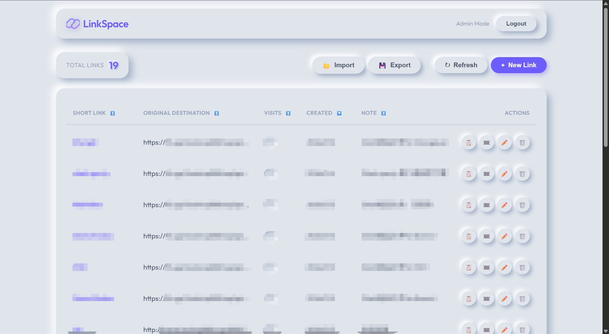

# 🚀 LinkSpace - 个人简易短链接管理平台

LinkSpace 是一个基于 Cloudflare 生态系统开发的轻量级、高性能 URL 短链接管理工具。采用现代化的“新拟物风格 (Neumorphism)”设计，专为个人使用而生。




## ✨ 功能亮点

- **⚡ 极速重定向**：利用 Cloudflare 边缘计算（Pages Functions），实现全球范围内的毫秒级跳转。
- **🎨 现代化 UI**：新拟物风格 (Neumorphism) 交互，提供极具质感且流畅的管理体验。
- **🛠 全能管理**：
  - **自定义短码**：支持随机生成或手动指定短链接后缀。
  - **访问统计**：实时追踪每个短链接的点击次数。
  - **二维码生成**：一键生成对应的 QR Code。
  - **导入导出**：支持 JSON 格式数据批量备份 with 迁移。
- **🔒 安全可靠**：内置简单高效的密码验证机制，数据存储于 Cloudflare 边缘 KV 数据库。

## 🛠 技术栈

- **前端**: Vue 3 (Vite), Vanilla CSS (Neumorphism)
- **后端**: Cloudflare Pages Functions (Edge Middleware)
- **存储**: Cloudflare Workers KV
- **路由**: Vue Router (SPA) + Cloudflare _redirects

## 🚀 部署指南

### 1. 克隆并准备环境
```bash
git clone https://github.com/ChenC2022/LinkSpace.git
cd LinkSpace
npm install
```

### 2. Cloudflare Pages 部署
1. 将代码推送到您的 GitHub 仓库。
2. 在 Cloudflare 控制台新建 **Pages** 项目，连接至该仓库。
3. **构建设置**：
   - 框架预设：`Vue`
   - 构建命令：`npm run build`
   - 输出目录：`dist`

### 3. 配置 KV 数据库 (核心)
1. 在 Cloudflare 控制台 -> **Storage & Databases** -> **KV** 中创建一个 KV 命名空间，名称可以自定义。
2. 回到您的 Pages 项目设置 -> **Settings** -> **Functions** -> **KV namespace bindings**。
3. 添加绑定：
   - **Variable name**: `LINKS` (必须全大写)
   - **KV namespace**: 选择您刚刚创建的空间。

### 4. 设置环境变量 (登录密码)
1. 在 Pages 项目设置 -> **Settings** -> **Environment variables**。
2. 添加变量：
   - **Type**: Secret (推荐)
   - **Variable name**: `ADMIN_PASSWORD`
   - **Value**: 您自定义的登录密码。

### 5. 绑定自定义域名 (可选)
1. 在 Pages 项目设置 -> **Custom domains** 选项卡。
2. 点击 **Set up a custom domain**。
3. 输入您自己的域名（如 `my.link` 或 `s.yourdomain.com`）。
4. 按照提示完成 DNS 验证。使用自定义域名会让您的短链接看起来更专业。

### 6. 重新部署
完成上述绑定后，在 **Deployments** 页面点击最新一次构建旁的 **Retry deployment**，使配置生效。

## 📖 使用说明
- **登录**：访问您的 Pages 域名，输入设置的 `ADMIN_PASSWORD` 即可进入控制台。
- **创建**：输入原始 URL 以及（可选的）短码。
- **刷新**：页面支持 SPA 刷新（已配置 `_redirects` 规则）。
- **跳转**：直接访问 `您的域名/短码` 即可实现重定向。

## 📄 开源协议
MIT License
